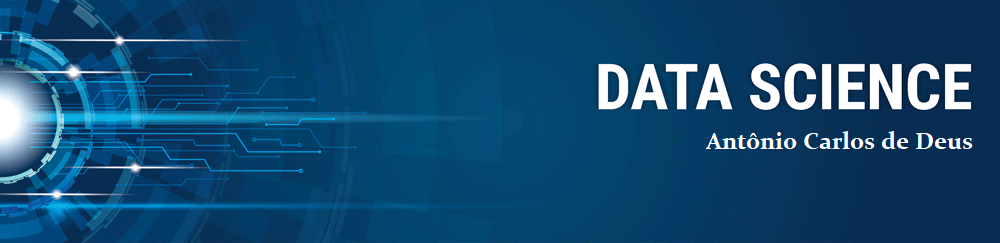

   

  

# Antônio Carlos de Deus
*Lead Data Scientist* at Innovation Center

As a beginner data scientist and industrial automation engineer at CSN Cimentos Brasil S.A., I combine analytical skills, ability to work in team environments and attention to detail. Having spent the last few years programming and improving controls, as well as implementing and fine-tuning specialist clinker kiln and cement mill control systems, I have developed critical thinking and problem solving skills.

My credentials include a degree in Computer Network Management, in Electrical Engineering (ongoing) with an MBA in Strategic Business Management from Centro Universitário UNA - BH.

**Background in:** Industrial Automation | Expert Systems | Remote Operation | Network Administration.

**Journey started in:** Python, MIT in Artificial Intelligence, Machine Learning and Deep Learning (Live)

**Links:**
* [LinkedIn](https://www.linkedin.com/in/acdeuspl)

## Projetos:
Veja os tutoriais publicados:

* **Como usar o Histograma para Data Science:** 
* **Como Implementar Regressão Linear com Python:**
* **Data Science: Investigando o naufrágio do Titanic:** 
* **Como Tratar Dados Ausentes com Pandas:** 
* **XGBoost: aprenda este algoritmo de Machine Learning em Python:** 
* **Como criar uma Wordcloud em Python:**
* **Como lidar com dados desbalanceados:** 

---
